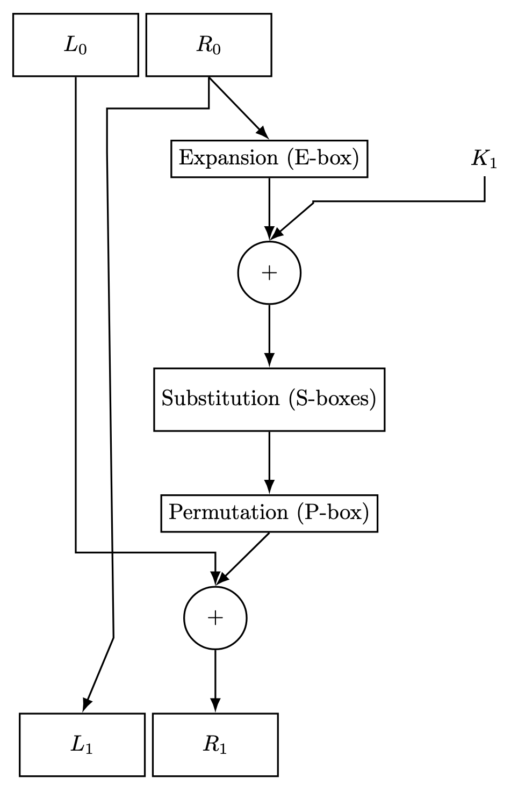

# Phase Two of Comp Sci 471: Cryptography

## We explored the Data Encryption Standard (DES), Diffie-Hellmann Key Exchange, and RSA.

This repository contains the code that I have submitted for Phase Two of my Computer Science Class of Cryptography. 

* Created a file that emulates the Feistel Round in DES.

## Feistel Round in Image Form

* Explored S-box (confusion) and P-box (diffusion) in those respective files
* Added file that contains the key scheduling used in the Feistel Round 
* Diffie-Hellmann Brute Force solved code shows that by 26-27 bit prime a normal computer struggles to brute force symmetric key encryption

