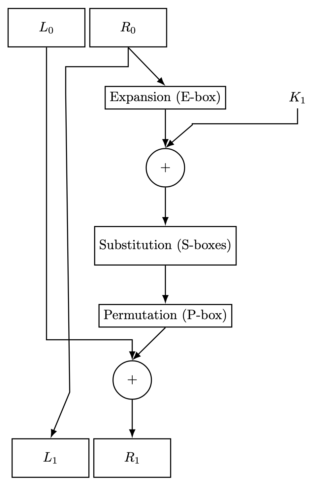

# Phase Two of Comp Sci 471: Cryptography

## We explored the Data Encryption Standard (DES), Diffie-Hellmann Key Exchange, and RSA.

This repository contains the code that I have submitted for Phase Two of my Computer Science Class of Cryptography. I've organized the files into three key folders:
* DES
* Diffie-Hellmann
* RSA 

You can look into the respective folders to better understand the details of the topics. Here are some of the things that we coded:

* Created a file that emulates the Feistel Round in DES.

    * Feistel Round in Image Form

* Explored S-box (confusion) and P-box (diffusion) in those respective files
* Added file that contains the key scheduling used in the Feistel Round 
* Diffie-Hellmann Brute Force solved code shows that by 26-27 bit prime a normal computer struggles to brute force symmetric key encryption
* Created home-made RSA implementation to decrypt a secret message and encrypt my own message into ciphertext

## How to tweak this project for your own uses

Feel free to take this code and test/improve the homemade DES, Diffie-Hellmann Key Exchange, and RSA for yourself.

## Find a bug?

If you found an issue or would like to submit an improvement ot this project, please notify me by email: ahuang25@andover.edu.

## Work in Progress
None
